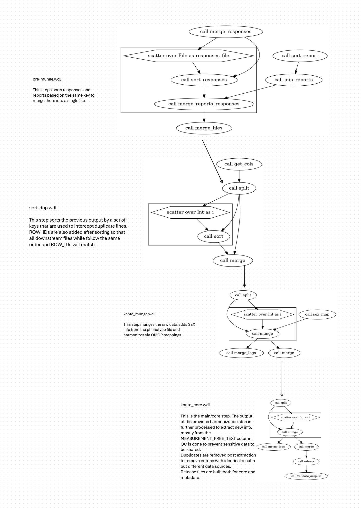

# KANTA LAB values preprocessing & QC

Based on Kira Detrois' [existing repo](https://github.com/detroiki/kanta_lab).

## CORE FILE

This is the file that contains mostly just workable data for analysis, like values,outcomes and pos/neg status both raw and extracted from free text where possible.

| Column Name | Easy Description | Technical Notes |
|---|---|---|
| `ROW_ID` | ROW ID that allows to compare lines across steps of the pipeline |  |
| `FINNGENID` | Pseudoanonimized IDs |  |
| `SEX` | Sex of the sample |  |
| `EVENT_AGE` | Age of the individual at the time fo the event |  |
| `APPROX_EVENT_DATETIME` | Approximate event (+- two weeks) of the event |  |
| `OMOP_CONCEPT_ID` | OMOP id of the mapping | The mapping is done using [a table](/finngen_qc/data/LABfi_ALL.usagi.csv) |
| `TEST_NAME` | Name of test. It's either the local one (manipulated to standard) or the national one mapped via the lab_id table | The map for the national (THL) IDs is in the [data folder](/finngen_qc//data/thl_lab_id_abbrv_map.tsv),and was downloaded from [Kuntaliitto - Laboratoriotutkimusnimikkeistö](https://koodistopalvelu.kanta.fi/codeserver/pages/classification-view-page.xhtml?classificationKey=88&versionKey=120) |
| `MEASUREMENT_UNIT_HARMONIZED` | The harmonized numeric value of the measurement |  |
| `MEASUREMENT_VALUE_HARMONIZED` | The harmonized unit of the measurement from the data | The conversion happens from [a table](/finngen_qc/data/quantity_source_unit_conversion.tsv) and by defining a target unit from [another table](/finngen_qc/data/harmonization_counts.txt) built using the most common unit for each concept ID |
| `MEASUREMENT_VALUE_EXTRACTED` | Numerical value extracted from the free text field | The column remove special prefixes (check config) and specific characteres (as before). If the remaining text is a float it's kept. |
| `MEASUREMENT_VALUE_MERGED` | The two numerical columns, merged into one. |  |
| `TEST_OUTCOME` | Abnormality of the lab measurement | Describes whether the test result is normal or abnormal i.e. too high or low low based on the laboratories reference values. This is **not** a quality control variable but to state it simply and inaccurately denotes whether the patient is healthy or not. See [AR/LABRA - Poikkeustilanneviestit](https://91.202.112.142/codeserver/pages/publication-view-page.xhtml?distributionKey=10329&versionKey=324&returnLink=fromVersionPublicationList) for the abbreviations. |
| `TEST_OUTCOME_IMPUTED` | Imputed abnormality values of the lab measurement | Values are ```H,L,N``` for high,low and normal. All entries with valid OMOP ids with >100 counts were imputed, including already labelled ones. Entries with `TEST_OUTCOME` but with non-numeric measurement values were *not* taken into account. The `*` sign indicates that there were issues in defining the threshold for `H/L` thresholds.In the data folder there's a [table](/core/data/abnormality_estimation.table.tsv) that shows the values used to determine lower/higher limits for each OMOP id. `+-inf` values lack enough labels to define a threshold. The `PROBLEM` columns indicate instead the opposite issue, where is there's an imbalance between H/L labels and `N` so the median value of the OMOP id is returned. |
| `OUTCOME_POS_EXTRACTED` | POSITIVE(1) or NEGATIVE(0) status extracted from free text. | We extracted all strings from the measurement free text field containing either `pos` or `neg` as a substring. We then checked them one by one and assigned to each a POS or NEG status. The mapping table can be seen [here](/core/data/negpos_mapping.tsv). Virtually all cases are straightforward as the Finnish language doesn't contain false positives (pun kinda intended). The only problematic entries are linked to RH pos/neg, which we decided to skip as they are not relevant. |
| `TEST_OUTCOME_TEXT_EXTRACTED` | Abnormality texts extracted from free text after standardization. It's formatted as `[<\>]\|[VALUE]\|[UNIT?]` | We applied similar filters as for `MEASUREMENT_VALUE_EXTRACTED` also allowing for a comparison (e.g. `Yli/Alle/</>`) and a unit as long as it's in list of target units (after basic string manipulation). |


## METADATA FILE

This is the file that contains more general metadata and source data tha can be used for debugging purposes.

| Column Name | Easy Description | Technical Notes |
|---|---|---|
| `ROW_ID` | ROW ID that allows to compare lines across steps of the pipeline |  |
| `FINNGENID` | Pseudoanonimized IDs |  |
| `SEX` | Sex of the sample |  |
| `EVENT_AGE` | Age of the individual at the time fo the event |  |
| `APPROX_EVENT_DATETIME` | Approximate event (+- two weeks) of the event |  |
| `OMOP_CONCEPT_ID` | OMOP id of the mapping | The mapping is done using [a table](/finngen_qc/data/LABfi_ALL.usagi.csv) |

The raw to output column mapping is as follows:

| Column in raw file           | Description              |
|------------------------------|--------------------------|
|FINNGENID|FINNGENID|
|EVENT_AGE|EVENT_AGE|
|tutkimuskoodistonjarjestelmaid|CODING_SYSTEM|
|paikallinentutkimusnimike|TEST_NAME_ABBREVIATION|
|tutkimustulosarvo|MEASUREMENT_VALUE|
|tutkimustulosyksikko|MEASUREMENT_UNIT|
|tutkimusvastauksentilaid|MEASUREMENT_STATUS|
|tuloksenpoikkeavuusid|TEST_OUTCOME|
|viitearvoryhma|REFERENCE_RANGE_GROUP|
|viitevalialkuarvo|REFERENCE_RANGE_LOWER_VALUE|
|viitevalialkuyksikko|REFERENCE_RANGE_LOWER_UNIT|
|viitevaliloppuarvo|REFERENCE_RANGE_UPPER_VALUE|
|viitevaliloppuyksikko|REFERENCE_RANGE_UPPER_UNIT|
|tutkimuksenlisatiet | MEASUREMENT_EXTRA_INFO |
|antaja_organisaatioid | SERVICE_PROVIDER_ID|





# MERGE OF RAW DATA

Inputs reports and responses are sorted over the same keys and merged

# DUPLICATE REMOVAL & SORTING
First the [wdl](/finngen_qc/wdl/sort_dup.wdl) trims the data of only the relevant columns (taken from the config) and sorts it by a series of columns (also specified in the config under `sort_cols`) so we can also discard duplicate entries. 


# Preprocessing
There is a [config file](/finngen_qc/magic_config.py) that contains all the relevant "choices" about how to manipulate the data (e.g. which columns to include, how to rename columns, which values of which column to include etc.) so there are virtually no hard coded elements in the code itself.

## TECHNICAL INFO
The code performs the following actions:
## [MINIMAL](/finngen_qc/filters/filter_minimal.py)
- output columns are initialized
- spaces are removed everywhere in the text
- the date is built in the right format
- all type of NA/missing values (Puuttuu,"_" etc.) are replaced with "NA"
- entries with invalid hetu root are removed (and logged)
- entries with invalid measurement status are removed (and logged)
- TEST_ID_IS_NATIONAL is created checking if `laboratoriotutkimusnimikeid` is not NA (1 national/0 regional)
- TEST_ID is created assigning the regional id for regional labs and a 
- TEST_NAME_ABBREVIATION is updated for national labs [through a mapping](/finngen_qc/data/thl_lab_id_abbrv_map.tsv)
- CODING_SYSTEM is updated when available (problematic ATM, see table above)
- CODING_SYSTEM_MAP is created from y-tunnukset in table
- SERVICE_PROVIDER_ID is updated where the mapping can happen
- TEST_NAME_ABBREVIATIONs with problematic characters are edited (see `abbreviation_replacements` in the config)

## [UNIT](/finngen_qc/filters/fix_unit.py)
- Fixes strange characters in the lab unit field. Also moves to lower case for non NA values.
- Mapping of units. This can be done either via regex (from config) or [through a mapping](/finngen_qc/data/unit_mapping.txt)
- TEST_OUTCOME is edited to be consistent with the standard definition see AR/LABRA - Poikkeustilanneviestit. This means replacing `<` with `L`, `>` with `H`, `POS` with `A` and `NEG` with `N`.

## [harmonization](/finngen_qc/filters/harmonization.py)
- Mapping status is updated (internal thing)
- IS_UNIT_VALID column is populated based on whether the unit is in usagi list
- Harmonizes units to make sure all abbreviations with similar units are mapped to the same one (e.g. mg --> mg/24h for du-prot). Based on [a table](/finngen_qc/data/fix_unit_based_in_abbreviation.tsv) 
- OMOP mapping from [a table](/finngen_qc/data/LABfi_ALL.usagi.csv)
- unit harmonization (optional but default) from [a table](/finngen_qc/data/quantity_source_unit_conversion.tsv)

## How it works
The script reads in the data in chunks of  `--chunksize` length and it processes the lines with Python's pandas. With the flag `--mp` and `--jobs` the script runs each chunk into other smaller subchunks in parallel (efficiency TBD). The [filter folder](/finngen_qc/filters/) contains separate scripts that perform conceptually separate tasks. Each of them contains a global function of the same name of the script that gathers all individual functions that populate the script. In this way we can easily compartmentalize the munging/qc and add new features.


```
usage: main.py [-h] [--raw-data RAW_DATA] [--log {critical,error,warn,warning,info,debug}] [--test] [--gz] [--mp [MP]] [-o OUT] [--prefix PREFIX] [--sep SEP] [--chunk-size CHUNK_SIZE] [--lines LINES] [--unit-map {regex,map,none}] [--harmonization [HARMONIZATION]]

Kanta Lab preprocessing pipeline: raw data ⇒ clean data.

options:
  -h, --help            show this help message and exit
  --raw-data RAW_DATA   Path to input raw file. File should be tsv.
 --log {critical,error,warn,warning,info,debug}Provide logging level. Example '--log debug', default = 'warning'
  --test                Reads first chunk only
  --gz                  Ouputs to gz
  --mp [MP]             Flag for multiproc. Default is '0' (no multiproc). If passed it defaults to cpu count, but one can also specify the number of cpus to use: e.g. '--mp' or '--mp 4'.
  -o OUT, --out OUT     Folder in which to save the results (default = current working directory)
  --prefix PREFIX       Prefix of the out files (default = 'kanta_YYYY_MM_DD')
  --sep SEP             Separator (default = tab)
  --chunk-size CHUNK_SIZE      Number of rows to be processed by each chunk (default = '100').
  --lines LINES         Number of lines in input file (calculated/estimated otherwise).
  --unit-map {regex,map,none}  How to replace units. Map uses the unit_mapping.txt mapping in data and regex after. Regex does only regex. none skips it entirely.
  --harmonization [HARMONIZATION]  Path to tsv with concept id and target unit.

```


# Core

The `core` folder contains the pipeline that produces a similar file, which is used for analysis purposes.

The current version outputs extra columns, which are taken from the `MEASUREMENT_FREE_TEXT` column, which cannot be shared due to data privacy reasons for the time being. The columns are:

| Column Name | Easy Description | General Notes | Technical Notes |
|---|---|---|---|
| `MEASUREMENT_VALUE_EXTRACTED` | Numerical values | The column is mutually exclusive with `harmonization_omop::MEASUREMENT_VALUE`. In our analysis the units seemed to be pretty much always coherent with our target OMOP units, albeit for occasional clusters of outliers that are present also in the core data. | The content of the `MEASUREMENT_FREE_TEXT` colum is cleaned by removal of spaces, converted to lower case, the target omop unit is removed if present, certain result strings are removed. If we're left with a pure float number, it's considered to be an extracted value. |
| `extracted::MEASUREMENT_VALUE_MERGED` | extracted::MEASUREMENT_VALUE_MERGED | Merge of original value column and of extracted value column |  |
| `OUTCOME_POS_EXTRACTED` | Boolean | Pos(1) or Neg(0) status | We extracted all strings containing the substring pos/neg and we manually mapped them to pos/neg statuses. The mapping is stored in the [data folder](/core/data/negpos_mapping.tsv) |
| `TEST_OUTCOME_TEXT_EXTRACTED` | Strings | Simplified/summarized strings present in free text. E.g. (YLI 3.0 ml --> >3ml). |  |


## TECHNICAL INFO

The princples are identical to the `finngen_qc` pipeline, just with different filters being used.

### [QC](/core/filters/qc.py)

This is for all sorts of QCing of the data, ideally for outlier filter/removal. For the time being the only QC in place is there for data privacy reasons:
- all extracted values that can be misinterpreted as dates are removed (DDMMYY) as they can either be birth dates or the exact date of the examination, which is shifted +- 2 weeks for each FINNGENID


### [EXTRACT](/core/filters/extract.py)

This filter extracts info from the free text column:

- extract_outcome: This function extracts test outcomes (e.g., "<5", ">10") from the "MEASUREMENT_FREE_TEXT" column. It identifies rows with status indicators, standardizes the text, parses the comparison operator, value, and unit, and stores the extracted outcome in a new column named "extracted::TEST_OUTCOME_TEXT". It also performs some data cleaning and unit mapping.

- extract_measurement: This function extracts numerical measurement values from the "MEASUREMENT_FREE_TEXT" column and stores them in a new column called "extracted::MEASUREMENT_VALUE". It also creates a "extracted::MEASUREMENT_VALUE_MERGED" column, which prioritizes values from the "harmonization_omop::MEASUREMENT_VALUE" column if available, otherwise using the newly extracted values.

- extract_positive: This function merges the input DataFrame (df) with a posneg_table based on the "MEASUREMENT_FREE_TEXT" column. It's designed to bring in pre-existing positive/negative classifications or related information associated with the free text measurements.

### [OUTCOME](/core/filters/outcome.py)
- `TEST_OUTCOME_IMPUTED` is generated from the (merged) numerical values based on thresholds learned from the data when both values and outcomes are present


## How it works
The princples are identical to the `finngen_qc` pipeline.

```
usage: main.py [-h] --raw-data RAW_DATA [--log {critical,error,warn,warning,info,debug}] [--test] [--gz] [--mp [MP]] [-o OUT] [--prefix PREFIX] [--sep SEP]
               [--chunk-size CHUNK_SIZE] [--lines LINES]

Kanta Lab analysis pipeline: clean data ⇒ analysis data.

options:
  -h, --help            show this help message and exit
  --raw-data RAW_DATA   Path to input raw file. File should be tsv.
  --log {critical,error,warn,warning,info,debug Provide logging level. Example '--log debug', default = 'warning'
  --test                Reads first chunk only
  --gz                  Ouputs to gz
  --mp [MP]             Flag for multiproc. Default is '0' (no multiproc). If passed it defaults to cpu count, but one can also specify the number of cpus  to use: e.g. '--mp' or '--mp 4'.
  -o OUT, --out OUT     Folder in which to save the results (default = current working directory)
  --prefix PREFIX       Prefix of the out files (default = 'kanta_YYYY_MM_DD')
  --sep SEP             Separator (default = tab)
  --chunk-size CHUNK_SIZE
                        Number of rows to be processed by each chunk (default = '1000*n_cpus').
  --lines LINES         Number of lines in input file (calculated/estimated otherwise).

```