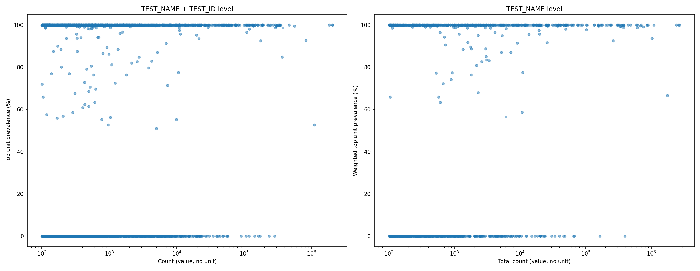

# Unit injection exploration

The goal is to identify lab measurements that have a numeric value but are missing a unit, and to characterise the unit distribution of the matching records that do have a unit — so that a unit can be confidently assigned to the missing ones.

## Usage

```bash
bash explore_test_name.sh <parquet_file> <min_count>
```

- `<parquet_file>`: path to the input parquet file (INJECT.parquet)
- `<min_count>`: minimum number of no-unit records a TEST_NAME+TEST_ID pair must have to be included

Each output file is skipped if it already exists.

---

## Step 1 — Injection targets (`test_name_id_counts.tsv`)

Counts records where at least one source value is present (`MEASUREMENT_VALUE_EXTRACTED IS NOT NULL OR MEASUREMENT_VALUE_HARMONIZED IS NOT NULL`) but the unit prefix is absent (`MEASUREMENT_UNIT_PRE_FIX IS NULL`), grouped by `(TEST_NAME, TEST_ID)`. Only pairs with count > `min_count` are kept.

Columns: `TEST_NAME`, `TEST_ID`, `COUNT`

These are the records we want to assign a unit to.

---

## Step 2 — Reference population (`test_name_id_details.tsv`)

For every TEST_NAME that appears in Step 1, describes the unit distribution of the records that already have both a value and a unit (`MEASUREMENT_VALUE_MERGED IS NOT NULL AND MEASUREMENT_UNIT_PRE_FIX IS NOT NULL`), grouped by `(TEST_NAME, TEST_ID)`. Note that this covers all TEST_IDs for those TEST_NAMEs, not just the ones above the threshold in Step 1.

Columns: `TEST_NAME`, `TEST_ID`, `COUNT`, `UNIT`, `PREVALENCE_DICT`

- `COUNT`: number of reference records for this pair
- `UNIT`: the most frequent unit for this pair
- `PREVALENCE_DICT`: JSON-like string with the top-3 units and their percentage share, e.g. `{mmol/l:98.5,umol/l:1.5}`

These records are the basis for deciding which unit to inject.

---

## Step 3 — Plotting tables and scatter plots

Two intermediate tables are built in Python by merging Steps 1 and 2, then a two-panel scatter plot is saved. Before any computation, Step 2 data is restricted to the `(TEST_NAME, TEST_ID)` pairs present in Step 1, so the plots only reflect injection-target pairs.

### `plot_name_id_level.tsv`

One row per `(TEST_NAME, TEST_ID)` from Step 1. Joined with the top unit prevalence from the reference population (Step 2) where available.

- `COUNT`: number of injection-target records
- `top_prevalence`: prevalence (%) of the dominant unit in the reference population for this pair; 0 if no reference records exist
- `has_unit_data`: whether any reference records exist for this pair

### `plot_name_level.tsv`

One row per `TEST_NAME`, aggregated from `plot_name_id_level.tsv`.

- `total_count`: sum of injection-target counts across all TEST_IDs
- `top_prevalence`: COUNT-weighted mean of `top_prevalence` across TEST_IDs that have reference records (TEST_IDs with no reference records are excluded from the average)

### `test_names_exploration_scatter.png`

Two scatter plots (log x-axis):

- **Left**: one dot per `(TEST_NAME, TEST_ID)` — x = injection-target count, y = top unit prevalence in reference population
- **Right**: one dot per `TEST_NAME` — x = total injection-target count, y = weighted top unit prevalence

Points in the top-right are high-volume tests with a consistent unit in the reference population — the best candidates for automated unit injection.


